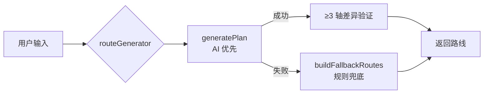

# 来都来了

> 不用做攻略，到了就会玩。

一个 H5 步行路线规划工具。输入位置、时间、偏好，AI 自动生成个性化的城市漫游路线。

## 技术栈

| 层 | 技术 |
|----|------|
| 前端 | Vue 3 + Vite + TypeScript + TailwindCSS |
| 后端 | Hono (Cloudflare Pages `_worker.js` 高级模式) |
| AI | DeepSeek `deepseek-v4-pro`（单一模型，无 fallback） |
| 地图 | 高德地图 JS API（前端）+ 高德 Web Services（后端，POI 搜索/验证/天气） |
| 测试 | Vitest（103 个测试用例，全 mock 确定性） |
| 部署 | Cloudflare Pages（`laidou-laile.pages.dev`） |
| CI | GitHub Actions |

## 目录结构

```
citywalk/
├── client/                      # Vue 3 前端 SPA
│   ├── src/
│   │   ├── components/          # 选择器、地图、Loading 等 UI 组件
│   │   ├── composables/         # Geolocation、RouteRequest、History
│   │   ├── pages/               # HomePage.vue（主入口）、RoutePage.vue（路线展示）
│   │   ├── services/api.ts      # 前端 API 调用
│   │   ├── data/                # 热门城市数据
│   │   └── types/               # 共享类型定义
│   └── index.html               # 入口页（含 Amap JS SDK 加载）
├── server/                      # Hono 后端（Cloudflare Workers）
│   ├── src/
│   │   ├── config/env.ts        # Zod 环境变量校验
│   │   ├── routes/              # API 路由 + Zod 请求校验 schemas
│   │   ├── middleware/          # 错误处理
│   │   ├── services/
│   │   │   ├── amap/            # 高德 Web Services 客户端（geocode/weather/poiSearch）
│   │   │   ├── llm/             # DeepSeek LLM 客户端（chat + prompt + schema 校验）
│   │   │   ├── planner/         # 路线规划逻辑（12 个模块，从 aiPlannerService 拆分）
│   │   │   ├── structuralDivergence.ts  # ≥30° 结构差异强制规则
│   │   │   └── routeGenerator.ts        # 顶层协调器
│   │   ├── types/               # 路线和 POI 类型
│   │   └── worker.ts            # Pages _worker.js 入口（Hono + 静态文件分发）
│   └── vitest.config.ts         # 测试配置
├── .github/workflows/ci.yml     # GitHub Actions CI
└── .env.example                 # 环境变量模板
```

## 快速开始

### 前置条件

- Node.js 22（见 `.node-version`）
- 两个高德 API Key：
  - **Web Services key**（服务端）：用于 POI 搜索、天气、地理编码
  - **JS API key**（前端）：用于地图显示，需要在[高德控制台](https://lbs.amap.com/dev/key/app)绑定域名白名单
- DeepSeek API Key：[platform.deepseek.com](https://platform.deepseek.com)

### 本地开发

```bash
# 1. 安装依赖
npm install

# 2. 配置服务端密钥
cp .env.example server/.dev.vars
# 编辑 server/.dev.vars，填入真实密钥：
#   AMAP_WEB_API_KEY=your_amap_web_key
#   LLM_API_KEY=your_deepseek_api_key

# 3. 启动后端（wrangler dev，端口 3000）
npm run dev -w server

# 4. 新终端，启动前端（vite，端口 9090，自动代理 /api → 3000）
npm run dev -w client

# 浏览器打开 http://localhost:9090
```

### 密钥配置说明

| 密钥 | 位置 | 用途 | 是否暴露 |
|------|------|------|---------|
| `AMAP_WEB_API_KEY` | `server/.dev.vars` + Pages 密钥 | 服务端 POI 搜索、天气查询 | 否 |
| `LLM_API_KEY` | `server/.dev.vars` + Pages 密钥 | DeepSeek API 调用 | 否 |
| Amap JS API key | `client/index.html` | 前端地图加载 | 需在[高德控制台](https://lbs.amap.com/dev/key/app)配置域名白名单 |
| Amap `securityJsCode` | `client/index.html` | 前端地图安全验证 | 需在控制台绑定域名 |

**重要**：前端的 Amap JS API key 和 `securityJsCode` 在 `client/index.html` 中硬编码，是因为浏览器端必须拿到它们才能加载地图。**必须在高德控制台 → 应用管理 → 添加域名白名单**，限制只有 `laidou-laile.pages.dev` 和 `localhost` 等可信域名可以使用。如果不配置，他人可能在其他域名下使用你的 Key。

### 运行测试

```bash
# 运行所有测试（103 个，全 mock，不消耗第三方 API）
npm test

# 查看测试覆盖率
cd server && npx vitest --coverage
```

### 类型检查 + 构建

```bash
# 类型检查（服务端 tsc + 前端 vue-tsc）
npm run typecheck

# 构建部署产物（前端 vite build + esbuild 打包 _worker.js）
npm run build
```

## API 端点

所有端点在 `POST /api/plan/*`，请求体为 JSON，返回统一格式：

```json
{ "error": { "code": "INVALID_PARAMS", "message": "..." } }
```

| 端点 | 说明 | 超时 |
|------|------|------|
| `POST /api/plan/generate` | 从位置+偏好生成路线 | LLM 25s + Amap 顺序验证 |
| `POST /api/plan/refine` | 优化已有路线（删除/新增需求） | LLM 25s |
| `POST /api/plan/replace-stop` | 替换路线中单个地点 | 仅 Amap 搜索 |
| `GET /api/health` | 健康检查 | — |

限流策略：
- 请求体最大 64 KB（超限返回 413）
- 同 isolate 内 5 秒相同请求去重（软去重，非分布式限流）
- 生产环境建议在 Cloudflare 控制台配置 Rate Limiting Rules（需要自定义域名）

## 架构与设计

### 路线生成流程



### AI 路径分支

`generatePlan` 根据偏好和时间自动选择策略：

| 条件 | 策略 |
|------|------|
| 仅 food，无子类型 | 高德搜索附近餐厅 → LLM 评分 → 美食清单 |
| food + 菜系 | 每种菜系独立搜索 → 3 维度对比卡片 |
| 仅 scenic，无子类型，局部范围 | 高德搜索 → LLM 主题路线 |
| 仅 wander，无子类型 | 高德搜索 → LLM 主题路线 |
| 半天/一天 | LLM 直接生成单条完整路线 |
| 其他组合 | LLM 生成 → 高德验证 |

### 结构差异规则

> 多路线模式下，任意两条路线必须有至少 2 个轴不同（≥30°差异），否则被丢弃。

三个轴：
- **goal**（功能目标）：eat / sightsee / culture / shop / relax / nature / nightlife
- **behavior**（用户行为）：deep_single / hop_multi / efficient_route / free_wander
- **info**（信息组织）：by_theme / by_ranking / by_geography / by_time

## 部署

### 首次部署

```bash
# 1. 构建
npm run build

# 2. 部署到 Cloudflare Pages
npx wrangler pages deploy client/dist --project-name laidou-laile

# 3. 交互式设置生产密钥（按提示粘贴真实值，密钥不会写入仓库）
npx wrangler pages secret put LLM_API_KEY --project-name laidou-laile
npx wrangler pages secret put AMAP_WEB_API_KEY --project-name laidou-laile
```

### 更新部署

```bash
npm run build && npx wrangler pages deploy client/dist --project-name laidou-laile
```

### 环境变量

| 变量 | 默认值 | 说明 |
|------|--------|------|
| `LLM_BASE_URL` | `https://api.deepseek.com/v1` | DeepSeek API 地址 |
| `LLM_MODEL` | `deepseek-v4-pro` | 模型名称 |
| `LLM_TIMEOUT_MS` | `35000` | LLM 请求超时 |
| `AMAP_TIMEOUT_MS` | `10000` | 高德 API 超时 |
| `NODE_ENV` | `production` | 运行环境 |

## 已知限制

- **未接入分布式限流**：当前只有同 isolate 软去重。生产环境需要自定义域名后在 Cloudflare 配置 Rate Limiting Rules
- **未实现营业时间校验**：`Stop` 类型预留了 `openTime/closeTime/openNow` 字段，但当前未使用
- **Amap JS SDK 必须配置域名白名单**：否则地图无法加载（见密钥配置说明）

## 许可

项目许可证以仓库中的许可证文件为准。